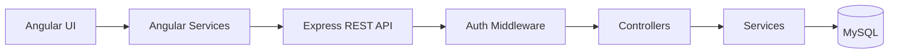

# Task Management System

A full-stack task management application: users sign up, log in, and manage their own tasks with status/priority tracking, server-side filtering and search, and a live analytics dashboard.

## Overview

Built as a technical assessment, optimized for clean architecture and being easy to explain in an interview as much as for working functionality. See [docs/INTERVIEW_GUIDE.md](docs/INTERVIEW_GUIDE.md) for a structured walkthrough of every design decision, and [docs/DECISIONS.md](docs/DECISIONS.md) for the reasoning behind each one.

## Features

- **Authentication** — signup, login, JWT-based sessions, protected routes, logout, bcrypt password hashing
- **Task CRUD** — create, read, update, delete, and mark-complete, each task scoped to its owner
- **Filtering & search** — by status, by priority, and free-text search across title/description — all server-side
- **Pagination & sorting** — server-side, via query parameters
- **Analytics dashboard** — total/completed/pending counts, completion %, breakdowns by status and priority, overdue count — from one aggregate API call
- **Responsive, dark-mode UI** — desktop table / mobile card layout, loading/empty/error states, toast notifications, confirm-before-delete

## Tech stack

| Layer | Technology |
|---|---|
| Frontend | Angular 16 (NgModules, lazy-loaded feature modules) |
| Backend | Node.js + Express |
| Database | MySQL 8 + Sequelize ORM |
| Auth | JWT (jsonwebtoken) + bcrypt |
| Validation | express-validator (backend), Angular Reactive Forms (frontend) |

## Architecture



Full diagrams and flow explanations: [docs/ARCHITECTURE.md](docs/ARCHITECTURE.md).

## Project structure

```
task-management-system/
├── backend/
│   ├── src/
│   │   ├── config/       env loading, Sequelize connection
│   │   ├── constants/     TASK_STATUS, TASK_PRIORITY, HTTP_STATUS
│   │   ├── models/         User, Task (Sequelize)
│   │   ├── validators/     express-validator chains
│   │   ├── middleware/      auth, validation, centralized errors
│   │   ├── controllers/     thin request handlers
│   │   ├── services/         business logic + queries
│   │   ├── routes/            endpoint wiring
│   │   ├── utils/              ApiError, apiResponse, asyncHandler, jwt
│   │   ├── app.js
│   │   └── server.js
│   ├── .env.example
│   └── package.json
│
├── frontend/
│   ├── src/app/
│   │   ├── core/          singleton services, guards, interceptors
│   │   ├── shared/          reusable presentational components
│   │   ├── layout/           navbar, main layout, auth layout
│   │   └── features/
│   │       ├── auth/           login, signup
│   │       ├── dashboard/       analytics dashboard
│   │       └── tasks/            task list/form/details + task components
│   └── package.json
│
├── docs/                 full documentation set (see below)
└── README.md             this file
```

## Prerequisites

- Node.js 18.13+ and npm 10+
- MySQL 8.x running locally (or reachable)

## Installation

```bash
cd backend && npm install
cd ../frontend && npm install
```

## Environment variables

Backend only — copy `backend/.env.example` to `backend/.env` and fill in real values (DB credentials, JWT secret). The frontend uses Angular's `src/environments/environment.ts` for its API base URL instead of a `.env` file. Full detail: [docs/SETUP.md](docs/SETUP.md).

## Running the backend

```bash
cd backend
npm run dev
```

Runs on `http://localhost:5000`. Health check: `GET /health`.

## Running the frontend

```bash
cd frontend
npx ng serve --port 4200
```

Runs on `http://localhost:4200` — requires the backend to already be running.

## API documentation

Every endpoint, with request/response examples: [docs/API.md](docs/API.md)

## Documentation

| Doc | Covers |
|---|---|
| [docs/ARCHITECTURE.md](docs/ARCHITECTURE.md) | System diagrams, request/auth/task/analytics flows |
| [docs/API.md](docs/API.md) | Full endpoint reference |
| [docs/DATABASE.md](docs/DATABASE.md) | Schema, relationships, indexes |
| [docs/AUTHENTICATION.md](docs/AUTHENTICATION.md) | JWT flow, step by step |
| [docs/FRONTEND.md](docs/FRONTEND.md) | Angular structure, routing, guards, interceptors |
| [docs/BACKEND.md](docs/BACKEND.md) | Express structure, request lifecycle |
| [docs/SETUP.md](docs/SETUP.md) | Full install & run guide |
| [docs/TESTING.md](docs/TESTING.md) | What was actually tested, and how |
| [docs/DECISIONS.md](docs/DECISIONS.md) | Why each major technical choice was made |
| [docs/TROUBLESHOOTING.md](docs/TROUBLESHOOTING.md) | Real issues hit during development |
| [docs/INTERVIEW_GUIDE.md](docs/INTERVIEW_GUIDE.md) | Structured explanation guide for this project |

## Testing

No automated test suite — the app was verified by running it: `curl` against a real MySQL-backed API, and a scripted headless-browser session covering the full user journey with zero console errors. Full detail, including every case exercised: [docs/TESTING.md](docs/TESTING.md).

## Future improvements

Refresh tokens, role-based access, real-time updates, advanced analytics, caching, background jobs, audit logging, an automated test suite, database migrations, and server-side token revocation — all explicitly scoped out of this build. Reasoning for each: [docs/INTERVIEW_GUIDE.md](docs/INTERVIEW_GUIDE.md#11-future-improvements).

## Author

Praveen K
